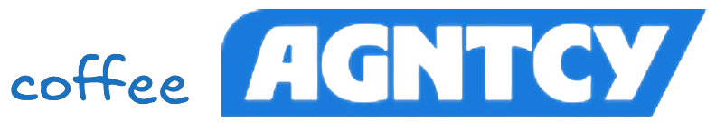

## About the Project

**Coffee Agntcy** is a reference implmentation based of fictious coffee company to help developers understand how components in the **AGNTCY Internet of Agents** ecosystem can work together. It give examples of the components of AGNTCY working togehter as a **Multi-agent System (MAS)**. The first setup of coffeeAgentcy shows how transport protocols and stateful LangGraph workflow are used to coordinate multi-agent behavior.

This project is ideal for developers building agent-based systems and looking to explore:

- How **SLIM** enables **broadcast** and **unicast** messaging
- How tools and transport can be reused across agent implementations (e.g., **SLIM**, **NATS**, **MCP**)
- How protocol-agnostic bridges and clients interconnect modular agents
- How to orchestrate agents using **LangGraph** for structured and stateful workflows
- How to integrate data sources (e.g., weather services via **MCP**)
- How to extend or swap agents modularly using AGNTCY tooling

---

### Setups Included

We currently provide two setups you can run to see how components from AGNTCY work together - one simple two agent used case and the other more as a complex MAS:

- **Corto**:  
  A two agent ready-to-run setup that highlights core agent interactions using agent-to-agent (A2A) messaging over AGNTCY’s SLIM transport. Agents are orchestrated within a LangGraph.
  👉 [View the Corto README](coffeeAGNTCY/coffee_agents/corto)

- **Lungo**:  
  A more advanced setup that will evaolve over time as we mature components.  The first release shows agents using A2A communicating via configurable transports (default: SLIM), are structured as directed LangGraphs, and include an MCP weather-aware farm that to fetch live data.  
  👉 [View the Lungo README](coffeeAGNTCY/coffee_agents/lungo)

---

### Built With

- [AGNTCY App SDK](https://github.com/agntcy/app-sdk) = v0.1.4
- [SLIM](https://github.com/agntcy/slim) = v0.3.15
- [A2A](https://github.com/a2aproject/a2a-python) = v0.2.5
- [MCP](https://github.com/modelcontextprotocol/python-sdk) >= v1.10.0
- [LangGraph](https://github.com/langchain-ai/langgraph) >= v0.4.1

---

## Contributing

This is a developer-facing reference repo. If you're building agentic systems—or interested in shaping the future of distributed agents—we'd love your feedback, contributions, or collaboration. Contributions are what make the open source community such an amazing place to
learn, inspire, and create. For detailed contributing guidelines, please see
[CONTRIBUTING.md](CONTRIBUTING.md)  

--------

## License

Distributed under the Apache-2.0 License. See [LICENSE](LICENSE) for more
information.

## Acknowledgements
- The [AGNTCY](https://github.com/agntcy) project.
