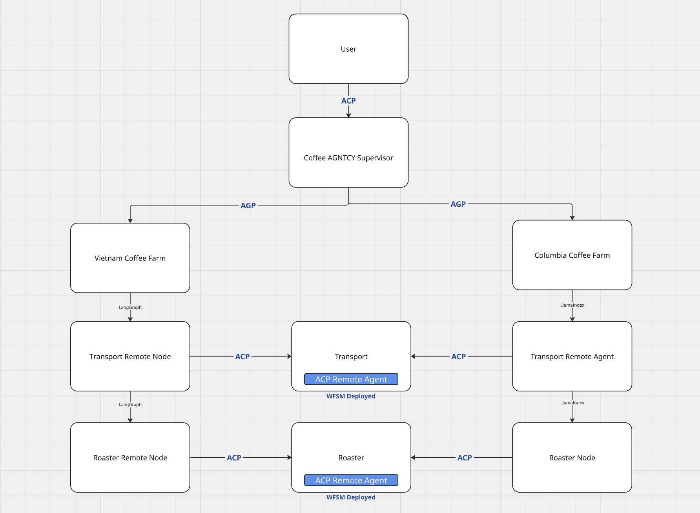

# Acorda Coffee Agntcy

[](CHANGELOG.md)
[](CODE_OF_CONDUCT.md)

## About The Project
Welcome to ...

* What is Acorda and IOA
* What IOA components are we using

## Architecture
* Tech diagram of agents and where IOA fits in
* Tech stack components to mention / highlight
   * agp
   * acp
   * wfsm
   * langgraph
   * llama-index
   * mcp

[]()

## Getting Started
Provide a comprehensive guide, from install, run-demo, contribute, deploy

### Prerequisites

This is an example of how to list things you need to use the software and how to
install them.

- docker-compose

### Installation

1. Clone the repository

   ```sh
   git clone https://github.com/cisco-outshift-ai-agents/acorda
   ```

### Run the demo
With the app running, walk through user journey.

## App deep dive (rename)
Walk through the app architecture, agentic patterns and code structure.
Run the agents individually and show how they work?

## Contributing

Contributions are what make the open source community such an amazing place to
learn, inspire, and create. Any contributions you make are **greatly
appreciated**. For detailed contributing guidelines, please see
[CONTRIBUTING.md](CONTRIBUTING.md)

## Documentation
We provide a documentation site via mkdocs and github pages.

Running the documentation site locally using mkdocs:

Install mkdocs and plugins:
```sh
pip install mkdocs
pip install mkdocs-material
pip install mkdocs-material-extensions
pip install markdown-include
```

Run the server:
```sh
mkdocs serve
```

Open the browser to [http://localhost:8000](http://localhost:8000)

## License

Distributed under the `<License name>` License. See [LICENSE](LICENSE) for more
information.

## Contact

Your Name - [@github_handle](https://github.com/github_handle) - email

Project Link:
[https://github.com/org_name/repo_name](https://github.com/org_name/repo_name)

## Acknowledgements

This template was adapted from
[https://github.com/othneildrew/Best-README-Template](https://github.com/othneildrew/Best-README-Template).

## Roadmap

See the [open issues](https://github.com/org_name/repo_name/issues) for a list
of proposed features (and known issues).
