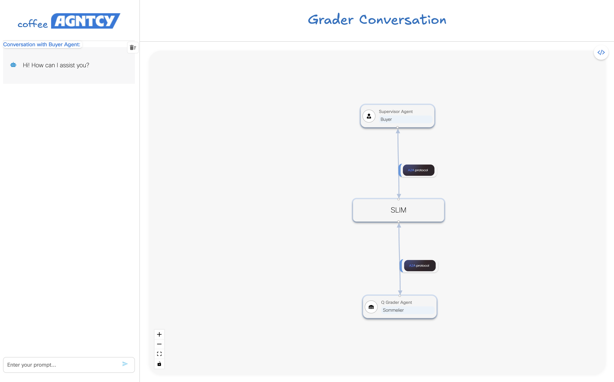

# Corto Exchange, Farm Server, UI

## Overview

The Corto demo showcases a streamlined interaction between a single-agent LangGraph workflow and an Agent-to-Agent (A2A) architecture. It models a simplified agent system focused on generating coffee flavor profiles based on user input.

The Exchange Agent acts as a client interface, receiving prompts from the user interface.

The Farm Agent serves as a backend flavor profile generator, processing incoming requests and returning descriptive output.

The user interface connects to the exchange’s API to submit prompts, which are routed via an A2A client to the farm’s A2A server. The underlying A2A transport layer is fully configurable. By default, the system uses SLIM, enabling flexible message delivery through broadcast or unicast modes depending on the request context.


## Running Corto Locally

You can use Corto in two ways:

1. **Local Python**  
   Run each component directly on your machine.

2. **Docker Compose**  
   Quickly spin up all components as containers using Docker Compose.


### Prerequisites

Before you begin, ensure the following tools are installed:

- **uv**: A Python package and environment manager.  
  Install via Homebrew:
  ```sh
  brew install uv
  ```

- **Node.js** version **16.14.0 or higher**  
  Check your version:
  ```sh
  node -v
  ```
  If not installed, download it from the [official Node.js website](https://nodejs.org/).

---
### Setup Instructions

1. **(Optional) Create a Virtual Environment:**
    Initialize your virtual environment using uv:

    ```sh
    uv venv
    source .venv/bin/activate
    ```

2. **Install Dependencies:**
   Run the following command to install all required Python dependencies:

   ```sh
   uv sync
   ```

3. **Configure Environment Variables**  
   Copy the example environment file:
   ```sh
   cp .env.example .env
   ```
   
   **Configure LLM Provider and Credentials**

   Then update `.env` with your LLM provider and credentials. For example:

   *OpenAI:*
   
   ```env
   LLM_PROVIDER=openai
   OPENAI_API_KEY=your_openai_api_key
   OPENAI_MODEL=gpt-4o
   ```

   *Azure OpenAI:*
   
   ```env
   LLM_PROVIDER=azure
   AZURE_OPENAI_ENDPOINT=https://your-azure-resource.openai.azure.com/
   AZURE_OPENAI_DEPLOYMENT=gpt-4-prod
   AZURE_OPENAI_API_KEY=your_azure_api_key
   AZURE_OPENAI_API_VERSION=2023-12-01-preview
   ```
   
  **Optional: Configure Transport Layer**

   You can also set the transport protocol and server endpoint by adding the following optional variables:

   ```env
   DEFAULT_MESSAGE_TRANSPORT=slim
   TRANSPORT_SERVER_ENDPOINT=http://localhost:3001
   ```

   - `DEFAULT_MESSAGE_TRANSPORT`: Defines the message transport protocol used for agent communication.
   - `TRANSPORT_SERVER_ENDPOINT`: The gateway or server endpoint for the specified transport.

   For a list of supported protocols and implementation details, see the [Agntcy App SDK README](https://github.com/agntcy/app-sdk). This SDK provides the underlying interfaces for building communication bridges and agent clients.

  **Optional: Configure Logging Level**
  
	You can configure the logging level using the LOGGING_LEVEL environment variable. During development, it's recommended to use DEBUG for more detailed output. By default, the logging level is set to INFO.
  
  ```env
  	LOGGING_LEVEL=debug
  ```

---

### Execution

>  **Note:** Each service should be started in its **own terminal window** and left running while the app is in use.
>
> **Shortcut:** If you prefer to spin up all services at once without reading through the steps below, you can:
> 
>
> Authenticate to GHCR to pull private images:
> 
>```sh
>echo "<git_token>" | docker login ghcr.io -u "<git_user>" --password-stdin
>```
>Replace `<git_token>` and `<git_user>` with your GitHub token and username.
>
> Start the stack:
>
>```sh
>docker compose up
>```
>
>Once running, access the UI at: [http://localhost:3000/](http://localhost:3000/)
>
>
> However, it is recommended to go through the steps below to better understand each component's role.

**Step 1: Run the SLIM Message Bus Gateway**

To enable A2A communication over SLIM, you need to run the SLIM message bus gateway. 

You can do this by executing the following command:

```sh
docker-compose up slim
```

**Step 2: Run the Farm Server**

Start the `farm_server`, which acts as an A2A agent, by executing:

*Local Python Run:*

```sh
uv run python farm/farm_server.py
```

*Docker Compose*

```sh
docker-compose up farm-server --build
```

The `farm_server` listens for requests from the `exchange` and processes them using LangGraph. It generates flavor profiles based on user inputs such as location and season.

**Step 3: Run the Exchange**

Start the `exchange`, which acts as an A2A client, by running:

*Local Python Run:*

```sh
uv run python exchange/main.py
```

*Docker Compose*

```sh
docker-compose up exchange-server --build
```

This starts a FastAPI server that processes user prompts that are sent to a LangGraph supervisor that facilitates worker agent delegation. The A2A client is registered as a worker agent. If a prompt does not match any worker, the supervisor responds politely with a refusal message.

To invoke the exchange, use the /agent/prompt endpoint to send a human-readable prompt to request information about a location's coffee flavor profiles for a specific season. For example:
```bash
curl -X POST http://127.0.0.1:8000/agent/prompt \
  -H "Content-Type: application/json" \
  -d '{
    "prompt": "What are the flavor notes of Colombian coffee in winter?"
  }'
```

The `exchange` sends user inputs to the `farm_server` and displays the generated flavor profiles. It interacts with the `farm_server` through A2A communication protocols.


**Step 4: Access the UI**

Once the backend and farm server are running, you can access the React UI by starting the frontend development server (from the `exchange/frontend` directory):

*Local Run:*

```sh
npm install
npm run dev
```

*Docker Compose:*

```sh
docker-compose up ui --build
```

By default, the UI will be available at [http://localhost:3000/](http://localhost:3000/).



