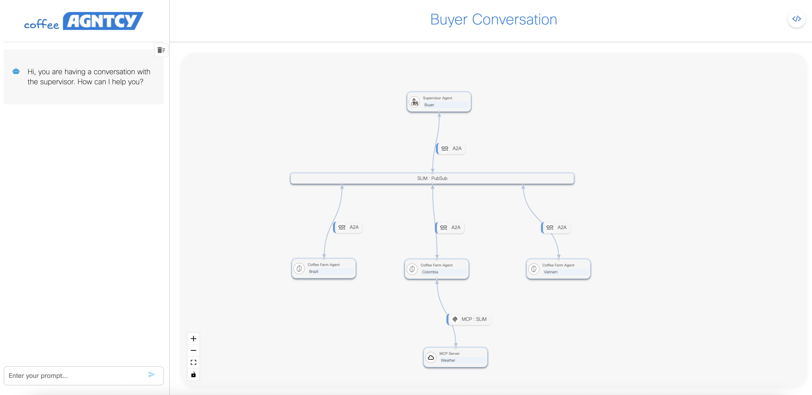
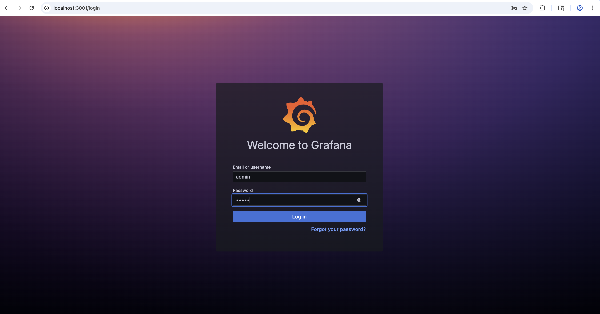
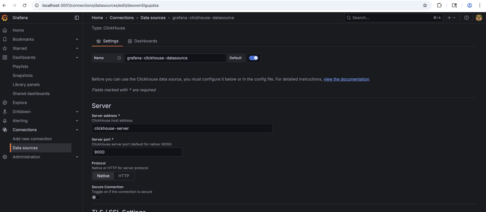
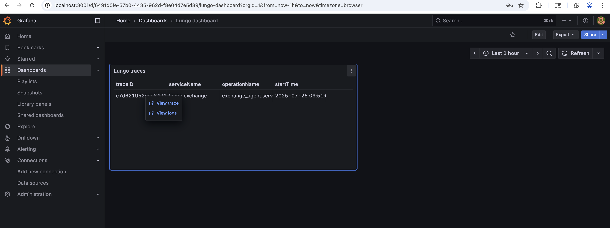

## Lungo Demo Overview

The **Lungo Demo** is a continuously evolving showcase of interoperable open-source agentic components. Its primary goal is to demonstrate how different components—from the **Agntcy** project and other open-source ecosystems—can work together seamlessly.

### Overview

The current demo models a **supervisor-worker agent ecosystem**, where:

- The **Supervisor Agent** acts as a *Coffee Exchange*, responsible for managing inventory and fulfilling orders.
- The **Worker Agents** represent *Coffee Farms*, which supply the inventory and provide order information.

All agents are implemented as **directed LangGraphs** with **Agent-to-Agent (A2A)** integration. The user interface communicates with the Supervisor’s API to submit prompts. These prompts are processed through the LangGraph and routed via an A2A client to the appropriate Farm’s A2A server.

The underlying A2A transport is configurable. By default, it uses **SLIM**, supporting both broadcast and unicast messaging depending on the context and data requirements.

One notable component is the **Colombia Farm**, which functions as an **MCP client**. It communicates with an MCP server (over SLIM) to retrieve real-time weather data used to calculate coffee yield.

## Running Lungo Locally

You can use Lungo in two ways:

1. **Local Python**  
   Run each component directly on your machine.

2. **Docker Compose**  
   Quickly spin up all components as containers using Docker Compose.

### Prerequisites

Before you begin, ensure the following tools are installed:

- **uv**: A Python package and environment manager.  
  Install via Homebrew:
  ```sh
  brew install uv
  ```

- **Node.js** version **16.14.0 or higher**  
  Check your version:
  ```sh
  node -v
  ```
  If not installed, download it from the [official Node.js website](https://nodejs.org/).

---

### Setup Instructions

1. **(Optional) Create a Virtual Environment**  
   Initialize your virtual environment using `uv`:
   ```sh
   uv venv
   source .venv/bin/activate
   ```

2. **Install Python Dependencies**  
   Use `uv` to install all required dependencies:
   ```sh
   uv sync
   ```

3. **Configure Environment Variables**  
   Copy the example environment file:
   ```sh
   cp .env.example .env
   ```
   
   **Configure LLM Provider, Credentials and OTEL endpoint**

   Then update `.env` with your LLM provider, credentials and OTEL endpoint. For example:

   *OpenAI:*
   
   ```env
    LLM_PROVIDER=openai
    OPENAI_API_KEY="your_openai_api_key_here"
    OPENAI_ENDPOINT=https://api.openai.com/v1 # Default OpenAI endpoint without proxy
    OPENAI_MODEL_NAME=gpt-4o
   ```

   *Azure OpenAI:*
   
   ```env
    LLM_PROVIDER=azure-openai
    AZURE_OPENAI_ENDPOINT=https://your-azure-resource.openai.azure.com/
    AZURE_OPENAI_DEPLOYMENT=gpt-4-prod
    AZURE_OPENAI_API_KEY=your_azure_api_key
    AZURE_OPENAI_API_VERSION=2023-12-01-preview
   ```
   
   *OTEL:*
   
   ```env
   OTLP_HTTP_ENDPOINT="http://localhost:4318"
   ```
   
  **Optional: Configure Transport Layer**

   You can also set the transport protocol and server endpoint by adding the following optional variables:

   ```env
   DEFAULT_MESSAGE_TRANSPORT=slim
   TRANSPORT_SERVER_ENDPOINT=http://localhost:46357
   ```

   - `DEFAULT_MESSAGE_TRANSPORT`: Defines the message transport protocol used for agent communication.
   - `TRANSPORT_SERVER_ENDPOINT`: The gateway or server endpoint for the specified transport.

   For a list of supported protocols and implementation details, see the [Agntcy App SDK README](https://github.com/agntcy/app-sdk). This SDK provides the underlying interfaces for building communication bridges and agent clients.

**Enable Observability with Observe SDK**

Make sure the following Python dependency is installed:
```
ioa-observe-sdk==1.0.12
```

For advanced observability of your multi-agent system, integrate the [Observe SDK](https://github.com/agntcy/observe/blob/main/GETTING-STARTED.md).

- Use the following decorators to instrument your code:
  - `@graph(name="graph_name")`: Captures MAS topology state for observability.
  - `@agent(name="agent_name", description="Some description")`: Tracks individual agent nodes and activities.
  - `@tool(name="tool_name", description="Some description")`: Monitors tool usage and performance.

- **To enable tracing for the Lungo multi-agent system:**
  - In code, set the factory with tracing enabled:
    ```python
    AgntcyFactory("lungo.exchange", enable_tracing=True)
    ```

- **To start a new trace session for each prompt execution:**  
  Call `session_start()` at the beginning of each prompt execution to ensure each prompt trace is tracked as a new session:
  ```python
  from ioa_observe_sdk import session_start

  # At the start of each prompt execution
  session_start()
  ```

---

### Execution

>  **Note:** Each service should be started in its **own terminal window** and left running while the app is in use.
>
> **Shortcut:** If you prefer to spin up all services at once without reading through the steps below, you canspin
> up the entire stack via Docker Compose:
>
>```sh
>docker compose up
>```
>
>Once running, access the UI at: [http://localhost:3000/](http://localhost:3000/), access grafana dashboard at: [http://localhost:3001/](http://localhost:3001/)
>
>
> However, it is recommended to go through the steps below to better understand each component's role.


**Step 1: Run the SLIM Message Bus Gateway and Observability stack**

To enable A2A communication over SLIM, you need to run the SLIM message bus gateway. 

Additionally run the observability stack that has OTEL Collector, Grafana and ClickHouse DB.

You can do this by executing the following command:

```sh
docker compose up slim clickhouse-server otel-collector grafana
```

**Step 2: Run the Weather MCP Server**

Start the MCP server, which uses the Nominatim API to convert location names into latitude and longitude coordinates, and then fetches weather data from the Open-Meteo API using those coordinates:

*Local Python Run:*

```sh
uv run python mcp_servers/weather_service.py
```

*Docker Compose:*

```sh
docker-compose up weather-mcp-server --build
```

This MCP server is required for the Colombia Farm to function correctly.

**Step 3: Run the Farms**

Start all the farm servers, that act as A2A servers, by executing:

*Local Python Run:*
>
>  **Note:** Each farm should be started in its **own terminal window**
>

```sh
uv run python farms/brazil/farm_server.py
uv run python farms/colombia/farm_server.py
uv run python farms/vietnam/farm_server.py
```

*Docker Compose:*

```sh
docker-compose up brazil-farm-server colombia-farm-server vietnam-farm-server --build
```

The farm servers handle incoming requests from the exchange and process them using a directed LangGraph containing two directed paths: one for fetching inventory and another for generating orders, depending on the prompt.

**Step 4: Run the Exchange**

Start the exchange, which acts as an A2A client, by running:

*Local Python Run:*

```sh
uv run python exchange/main.py
```

*Docker Compose:*

```sh
docker-compose up exchange-server --build
```

This command starts a FastAPI server that processes user prompts by passing them to a LangGraph-based supervisor, which manages delegation to worker agents. The supervisor is implemented as a directed LangGraph with nodes for Inventory, Orders, General Information, and Reflection.

Requests that are not related to inventory or order creation are automatically routed to the General Information node, which returns a default response. Inventory requests without a specified farm are broadcast across all farms to collect inventory data. If a specific farm is provided, the request is sent directly to that farm. Order requests are sent one-to-one to a specified farm and must include the farm location and acceptable price.

To invoke the exchange, use the /agent/prompt endpoint to send a human-readable prompt to ask information about coffee inventory or to place an order. For example:

```bash
curl -X POST http://127.0.0.1:8000/agent/prompt \
  -H "Content-Type: application/json" \
  -d '{
    "prompt": "How much coffee does the Colombia farm have?"
  }'
```

*Example prompts:*

| Intent        | Prompt                                                   |
|---------------|-----------------------------------------------------------|
| Check inventory for a specific farm | How much coffee does the Colombia farm have? |          
| Check inventory across farms     | Show me the total inventory across all farms. |            
| Order Request   | I need 50 lb of coffee beans from Colombia for 0.50 cents per lb  |   

**Step 5: Access the UI**

Once all services are running, you can access the React UI by starting the frontend development server (from the `exchange/frontend` directory):

*Local Run:*

```sh
npm install
npm run dev
```

*Docker Compose:*

```sh
docker-compose up ui --build
```

By default, the UI will be available at [http://localhost:3000/](http://localhost:3000/).



**Step 6: Visualize OTEL Traces in Grafana**

1. **Access Grafana**  
   Open your browser and go to [http://localhost:3001/](http://localhost:3001/).  
   Log in with the default admin credentials (username: `admin`, password: `admin` unless you changed it).

   

2. **Connect/Add the ClickHouse Datasource**  
   - In the left sidebar, click on **"Connections" > "Data sources"**.
   - If not already present, add a new **ClickHouse** datasource with the following settings:
     - **Server address:** `clickhouse-server`
     - **Port:** `9000`
     - **Protocol:** `native`
     - **User/Password:** `admin` / `admin`
   - If already present, select the **ClickHouse** datasource (pre-configured in the Docker Compose setup).

   
    


3. **Import the OTEL Traces Dashboard**  
   - In the left sidebar, click on **"Dashboards" > "New" > "Import"**.
   - Upload or paste the JSON definition for the OTEL traces dashboard, located here:  
     [`lungo_dashboard.json`](lungo_dashboard.json)
   - **When prompted, select `grafana-clickhouse-datasource` as the datasource.**
   - Click **"Import"** to add the dashboard.

   

4. **View Traces for the Lungo Multi-Agent System**  
   - Navigate to the imported dashboard.
   - You should see traces and spans generated by the Lungo agents as they process requests.
   - **To view details of a specific trace, click on a TraceID in the dashboard. This will open the full trace and its spans for further inspection.**

   
   
